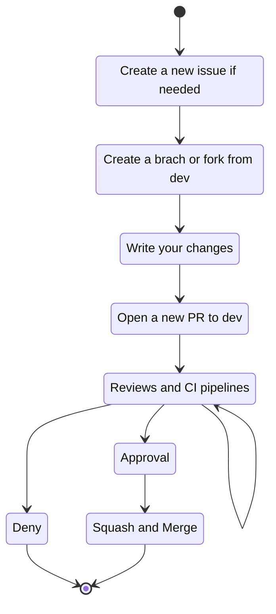
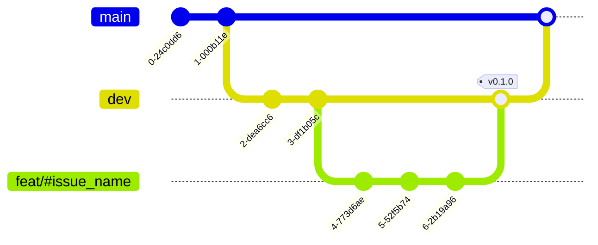

# General organization contribution guidelines

> [!NOTE]  
> This document describes the general contribution guidelines for all repositories in the organization. For repository-specific contribution guidelines, please refer to the `CONTRIBUTING.md` file in the repository.

Inspired from [hawks-atlanta/docs](https://github.com/hawks-atlanta/docs/blob/main/CONTRIBUTING.md)

## Workflow

When contributing, please follow the workflow described below.

## Branches and commits

- `main`: The main branch, which is always production-ready.
- `dev`: The development branch, which is always the latest development version.
- `semantic/*`: Feature branches, which are branched off of `dev` and merged back into `dev` when complete.

Note that your branch and commits should be named according to the [Conventional Commits Specification](https://www.conventionalcommits.org/en/v1.0.0/). This is required for the automatic versioning, changelog generation, and to ease the review process.

Additionally, in the branch name, you should include the issue number that the branch is addressing. For example, if you are working on issue #123, your branch name should be `feat/#123_name` where `name` is a short description of the issue.

Finally, you should squash your commits into a single commit before merging your branch into `dev`. This is aimed to keep the commit history clean and easy to read. It's also important to use [Conventional Commits](https://www.conventionalcommits.org/en/v1.0.0/) in the squashed commit message.

## Pull requests

When opening a pull request, you should use a semantic title similar to the branch name. For example, if you are working on issue #123, your pull request title should be `feat: name` where `name` is a short description of the issue.

Additionally, you should use the pull request template provided by each repository or provide relevant information about the pull request.

## Issues

When opening an issue, you should use a semantic title. For example, if you are creating an issue for a bug, your issue title should be `fix: name` where `name` is a short description of the bug.

Additionally, you should use the issue template provided by each repository or provide relevant information about the issue.

# Documentation repository contribution guidelines

If you update any of the diagrams in this repository, please remember to update the diagram source files as well.

Source files are usually a `.drawio` file, which can be edited using [draw.io](https://app.diagrams.net/).

However, most of the times, the source file is a `.md` file, which can be edited using [mermaid live editor](https://mermaid-js.github.io/mermaid-live-editor/).
