# Entity relationship diagram 🎨

```mermaid
erDiagram
    users ||--o{ courses_has_users:       "Belong to multiple courses"
    users ||--o{ submissions:           "Make submissions"
    users ||--o| grades:                "Have grades"

    courses }o--|| users:               "Have teacher"
    courses }o--|| colors:              "Have color"
    courses ||--o{ courses_has_users:     "Have students"
    courses ||--o{ laboratories:        "Have laboratories"
    courses ||--o| invitation_codes:    "Can have an invitation code"

    laboratories ||--o{ markdown_blocks:    "Have instructions"
    laboratories ||--o{ test_blocks:        "Have tests"
    laboratories ||--o|	rubrics:            "Can have a rubric"
    grades }o--|| laboratories:             "Belong a laboratory"
    grades ||--o{ grades_criteria:          "Can be obtained from criteria"


    test_blocks  }o--|| languages:      "Have programming language"
    submissions }o--|| test_blocks:    "Belong to a test"

    submissions     }o--|| archives:        "Have a tests archive"
    test_blocks     }o--|| archives:        "Have a tests archive"
    languages       }o--|| archives:        "Have a submission archive"

    rubrics ||--|{	objectives:         "Have one or more objectives"
    objectives ||--|{ criteria:         "Have one or mor criteria"

    users {
        UUID            id                  "PK; AUTO"
        USER_ROLES      role                "NOT NULL; DEFAULT 'student'; ENUM ['admin', 'teacher', 'student']"
        VARCHAR(16)     institutional_id    "NOT NULL; UNIQUE"
        CITEXT          email               "NOT NULL; UNIQUE"
        VARCHAR         full_name           "NOT NULL"
        VARCHAR         password_hash       "NOT NULL"
        UUID            created_by          "NULL, REFERENCES users.id"
    }

    courses {
        UUID            id                  "PK; AUTO"
        UUID            teacher             "FK; REFERENCES users.uuid"
        UUID            color_id            "FK; REFERENCES colors.uuid"
        VARCHAR(255)    name                "NOT NULL"
    }

    invitation_codes {
        UUID            course_id       "PK, REFERENCES courses.id"
        VARCHAR(9)      code            "NOT NULL; UNIQUE;"
        TIMESTAMP       created_at      "NOT NULL; DEFAULT CURRENT_TIMESTAMP"
    }

    colors {
        UUID        id              "PK; AUTO"
        CHAR(9)     hexadecimal     "NOT NULL; UNIQUE"
    }

    courses_has_users {
        UUID        course_id            "FK; REFERENCES courses.id"
        UUID        user_id             "FK; REFERENCES users.id"
        BOOLEAN     is_class_hidden     "DEFAULT FALSE"
        BOOLEAN     is_user_active      "DEFAULT TRUE"
    }

    laboratories {
        UUID                id              "PK; AUTO"
        UUID                course_id        "FK; REFERENCES courses.id"
        UUID                rubric_id       "FK; DEFAULT NULL; REFERENCES rubrics.id"
        VARCHAR(255)        name            "NOT NULL"
        Timestamp           opening_date    "NOT NULL"
        Timestamp           due_date        "NOT NULL"
    }

    archives {
        UUID            id              "PK; AUTO"
        UUID            file_id         "NOT NULL; UNIQUE"
    }

    blocks_index {
        UUID            id              "PK; AUTO"
        UUID            laboratory_id   "FK; REFERENCES laboratories.id"
        SMALLINT        block_position  "NOT NULL"
    }

    markdown_blocks {
        UUID            id                  "PK; AUTO"
        UUID            laboratory_id       "FK; REFERENCES laboratories.id"
        UUID            block_index_id      "FK; REFERENCES blocks_index.id" 
        VARCHAR()       content             "NULL"
    }

    test_blocks {
        UUID            id                  "PK; AUTO"
        UUID            language_id         "FK; REFERENCES languages.id"
        UUID            tests_archive_id    "FK; REFERENCES archives.id"
        UUID            laboratory_id       "FK; REFERENCES laboratories.id"
        UUID            block_index_id      "FK; REFERENCES blocks_index.id" 
        VARCHAR(255)    name                "NOT NULL"
    }

    languages {
        UUID            id                      "PK; AUTO"
        UUID            template_archive_id     "FK; REFERENCES archives.id"
        VARCHAR(32)      name                   "NOT NULL; UNIQUE"
    }

    submissions {
        UUID            id                  "PK; AUTO"
        UUID            test_block_id       "FK; REFERENCES test_blocks.id"
        UUID            student_id          "FK; REFERENCES users.id"
        UUID            archive_id          "FK; REFERENCES archives.id"
        BOOLEAN         passing             "DEFAULT FALSE"
        VARCHAR(16)     status              "DEFAULT 'pending'; ENUM ['pending', 'running', 'ready']"
        VARCHAR()       stdout              "DEFAULT NULL"
        TIMESTAMP       submitted_at        "NOT NULL; DEFAULT CURRENT_TIMESTAMP"
    }

    rubrics {
        UUID            id              "PK; AUTO"
        UUID            teacher_id      "FK; REFERENCES users.id"
        VARCHAR(255)    name            "NOT NULL"
    }

    objectives {
        UUID            id              "PK; AUTO"
        UUID            rubric_id       "FK; REFERENCES rubrics.id"
        VARCHAR(255)    name            "NOT NULL"
        TIMESTAMP       created_at      "NOT NULL; DEFAULT CURRENT_TIMESTAMP"
    }

    criteria {
        UUID                id              "PK; AUTO"
        UUID                objective_id    "FK; REFERENCES objectives.id"
        VARCHAR()           description     "NOT NULL"
        DECIMAL()           weight          "NOT NULL"
        TIMESTAMP           created_at      "NOT NULL; DEFAULT CURRENT_TIMESTAMP"
    }

    grades {
        UUID        id                  "PK; AUTO"
        UUID        laboratory_id       "FK; REFERENCES laboratory.id"
        UUID        student_id          "FK; REFERENCES users.id"
        UUID        rubric_id           "FK; REFERENCES rubric.id"
        TEXT        comment             "NOT NULL; DEFAULT ''"
    }

    grades_criteria {
        UUID        grade_id        "FK; REFERENCES grades.id"
        UUID        objective_id    "FK; REFERENCES objectives.id"
        UUID        criteria_id     "FK; REFERENCES criteria.id"
    }
```

## Indexes 📚

- Add an `UNIQUE` constraint to the `course_has_users` table to prevent students from joining the same course multiple times. `UNIQUE (course_id, user_id)`.

- Add an `UNIQUE` constraint to the `submissions` table to prevent students from submitting code to the same tests multiple times: `UNIQUE (test_block_id, student_id)`.

- Add an `UNIQUE` constraint to the `grades` table to prevent students from being graded multiple times for the same laboratory with the same rubric: `UNIQUE (laboratory_id, student_id, rubric_id)`.

- Add an `UNIQUE` constraint to the `grades_criteria` table to prevent objectives to be graded multiple times for the same laboratory using different criteria: `UNIQUE (grade_id, objective_id)`.

- Add an `UNIQUE` constraint to the `blocks_index` table to prevent multiple blocks to be added to the same laboratory with the same position: `UNIQUE (laboratory_id, block_position)`.

## Design notes 🤔

- `Laboratories` are made up of `markdown blocks` to provide instructions to the students and `test blocks` to test the code written by the students.

- The `markdown blocks` are used by teachers to provide instructions to the students.

- The `test blocks` are used to test the code written by the students.

- The `colors` table is used to easily modify the color scheme of the system. Each course should have a randomly chosen color from the `colors` table associated with it.

- The `languages` table stores the programming languages that can be used to write the code for the test blocks. The only supported language will be Java for now, but **the system needs to be able to support multiple languages in the future**.

    - The `template_archive_id` column is used to store the UUID used as the name of the archive in the file system. 

- The `blocks_index` allows us to easily get an index for new blocks added to a laboratory. Also, having a separate table for the index allows us to easily change the order of the blocks without worrying about the type of the block.

- The `rubric_id` field in the `grades` table allows teachers to grade students using different rubrics for the same laboratory (Ex: The teacher first grades the students using a rubric A but then decides to change the rubric to B and grade the students again).