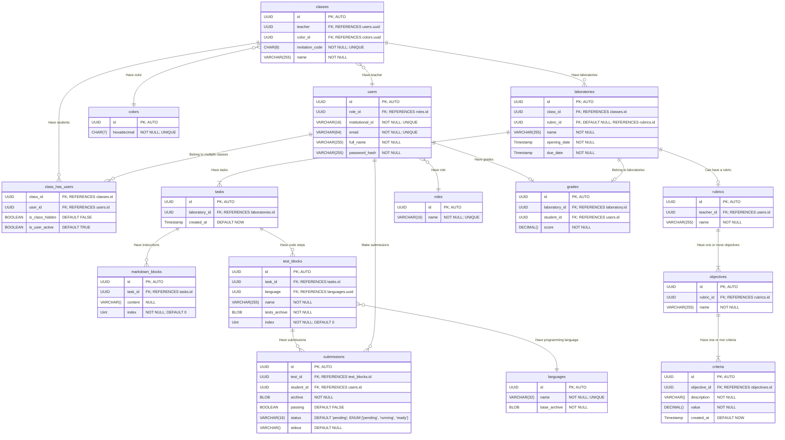

# Entity relationship diagram 🎨

## Design notes 🤔

- `Laboratories` are made up of `tasks` which are made up of `markdown blocks` and `test blocks`.

- The `markdown blocks` are used by teachers to provide instructions to the students.

- The `test blocks` are used to test the code written by the students.

- The `colors` table is used to easily modify the color scheme of the system. Each class should have a randomly chosen color from the `colors` table associated with it.

- The `languages` table stores the programming languages that can be used to write the code for the test blocks. The only supported language will be Java for now, but **the system needs to be able to support multiple languages in the future**.

- The `base_archive` field in the `languages` table is a zip file containing the base code that will be used by the teachers to write the tests and by the students to write their code. This archive will be defined by the programmers.

- Add an `UNIQUE` constraint to the `submissions` table to prevent students from submitting code to the same tests multiple times. `UNIQUE (test_id, student_id)`.
