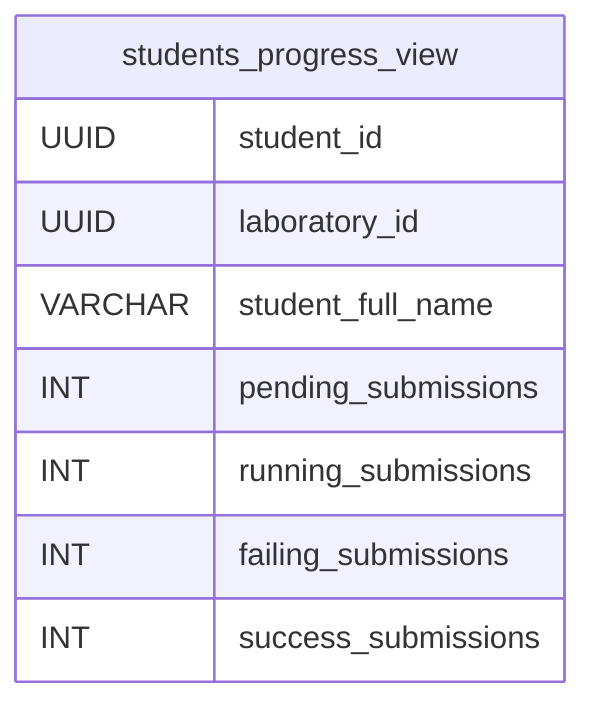
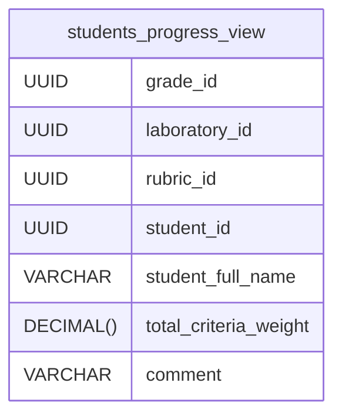

# Database views 🪟

## Students progress view

The following view is used to track the progress of the students in a laboratory. This is helpful to don't have to run a complex query every time we want to know how many submissions a student (or all students in a laboratory) has pending, running, failing or successful.



Please note that the view won't show the students that have no submissions in a laboratory. This is because the view is based on the `submissions` table, so if a student has no submissions, it won't be shown in the view. To solve from the client-side, you can fetch all the students in the course that holds the laboratory and then join two arrays, using `0` as the default value for the missing submissions:

```js
// Result of fetching all the students in a course
const students = [
  { id: '1', full_name: 'John Doe' foo: bar },
  { id: '2', full_name: 'Jane Doe' foo: bar },
];

// Result of fetching the students progress in a laboratory
const studentsProgress = [
  { student_id: '2', laboratory_id: '1', pending_submissions: 0, running_submissions: 0, failing_submissions: 1, success_submissions: 5 },
];

// Result of joining the two arrays
const joined = [
  { id: '1', full_name: 'John Doe' foo: bar, pending_submissions: 0, running_submissions: 0, failing_submissions: 0, success_submissions: 0 },
  { id: '2', full_name: 'Jane Doe' foo: bar, pending_submissions: 0, running_submissions: 0, failing_submissions: 1, success_submissions: 5 },
];
```

## Summarized grades

This view is used to sum all the `weight` of the `criteria` chosen by the teacher from a `rubric` to grade a `laboratory` of a `student`. This is helpful to don't have to run a complex query every time we want to know the summarized grade of a student in a laboratory.



As in the previous view, this view won't show the students that have no grades in a laboratory. This is because the view is based on the `grades` table, so if a student has no grades, it won't be shown in the view. It is possible to solve this from the client-side, similar to the previous view.
