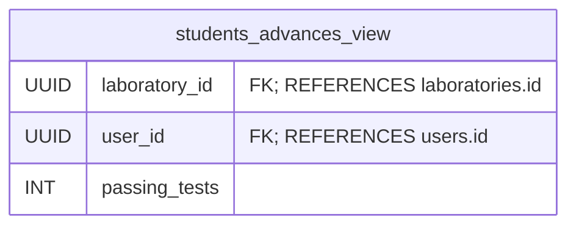

# Database views 🪟

## Students advances view

### Columns



### Query

```sql
CREATE OR REPLACE VIEW students_advances_view AS
    SELECT
        laboratory.id     AS laboratory_id,
        submissions.student_id  AS user_id,
        COUNT(submissions.id)   AS passing_tests
    FROM submissions
    JOIN test_blocks ON submissions.test_id = test_blocks.id
    JOIN laboratories ON test_blocks.laboratory_id = laboratories.id
    WHERE submissions.passing = TRUE
    GROUP BY submissions.test_id, submissions.student_id;
```
