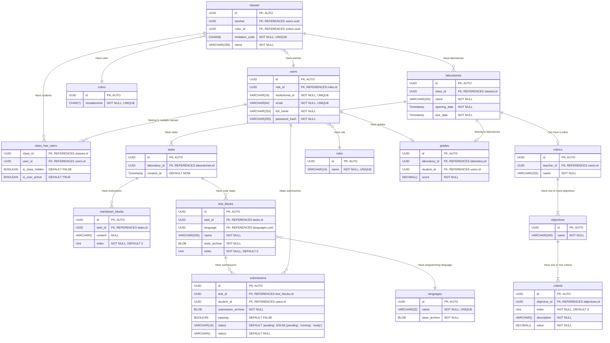

# Entity relationship diagram 🎨



## Design notes 🤔

- `Laboratories` are made up of `tasks` which are made up of `markdown blocks` and `test blocks`.

- The `markdown blocks` are used by teachers to provide instructions to the students.

- The `test blocks` are used to test the code written by the students.

- The `colors` table is used to easily modify the color scheme of the system. Each class should have a randomly chosen color from the `colors` table associated with it.

- The `languages` table stores the programming languages that can be used to write the code for the test blocks. The only supported language will be Java for now, but **the system needs to be able to support multiple languages in the future**.

- The `base_archive` field in the `languages` table is a zip file containing the base code that will be used by the teachers to write the tests and by the students to write their code. This archive will be defined by the programmers.

## Dummy queries 🏗️

### Create a new class

The `color` field can be chosen from the API using the `colors` table since it wont change often.

The `invitation_code` field can be generated in the API using a random string generator. The 8 character length gives enough combinations to avoid collisions but **it's important to make sure that the generated code is unique**.

```sql
CREATE OR REPLACE FUNCTION create_class(
    teacher_id UUID,
    name VARCHAR(255),
    invitation_code VARCHAR(8),
    color_id UUID
)
    RETURNS UUID
    LANGUAGE PLPGSQL
    AS $$
DECLARE
    class_id UUID;
BEGIN
    INSERT INTO classes (teacher, name, invitation_code, color_id)
    VALUES (teacher_id, name, invitation_code, color_id)
    RETURNING id INTO class_id;

    RETURN class_id;
END $$
```

### Create a new laboratory

Creating a new laboratory also creates a default or first tasks to allow the teachers to start writing instructions and tests.

```sql
CREATE OR REPLACE FUNCTION create_laboratory(
    class_id UUID,
    name VARCHAR(255),
    opening_date TIMESTAMP,
    due_date TIMESTAMP
)
    RETURNS RECORD
    LANGUAGE PLPGSQL
    AS $$
DECLARE
    laboratory_id UUID;
    first_task_id UUID;
    result RECORD;
BEGIN
    INSERT INTO laboratories (class_id, name, opening_date, due_date)
    VALUES (class_id, name, opening_date, due_date)
    RETURNING id INTO laboratory_id;

    INSERT INTO tasks (laboratory_id)
    VALUES (laboratory_id)
    RETURNING id INTO first_task_id;

    result := (laboratory_id, first_task_id);
    RETURN result;
END $$
;
```

### Swap the position of two blocks

The position of two blocks can be swapped by changing their `index` field. The teachers should be able to swap the positions of two adjacent blocks by clicking on up and down arrows.

```sql
CREATE OR REPLACE FUNCTION swap_blocks(
    first_block_id UUID,
    second_block_id UUID
)
    RETURNS VOID
    LANGUAGE PLPGSQL
    AS $$
DECLARE
    first_block_index UINT;
    second_block_index UINT;
BEGIN
    SELECT index INTO first_block_index FROM markdown_blocks WHERE id = first_block_id;
    SELECT index INTO second_block_index FROM markdown_blocks WHERE id = second_block_id;

    UPDATE markdown_blocks SET index = second_block_index WHERE id = first_block_id;
    UPDATE markdown_blocks SET index = first_block_index WHERE id = second_block_id;
END $$
;
```
