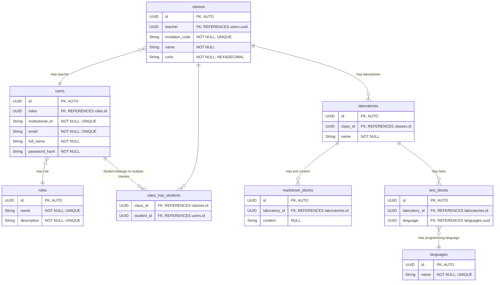

# Entity relationship diagram

## Design notes

- `Laboratories` are built from blocks of markdown and test code.

- The `markdown blocks` are used by teachers to provide instructions to the students.

- The `test blocks` are used to test the code written by the students.

- The test file is created and uploaded by the teacher. It's not stored in the database but can be accessed from the file system using the `test_blocks.id` as the file name.

- The `languages` table stores the programming languages that can be used to write the code for the test blocks. The only supported language will be Java for now, but **the system needs to be able to support multiple languages in the future**.
