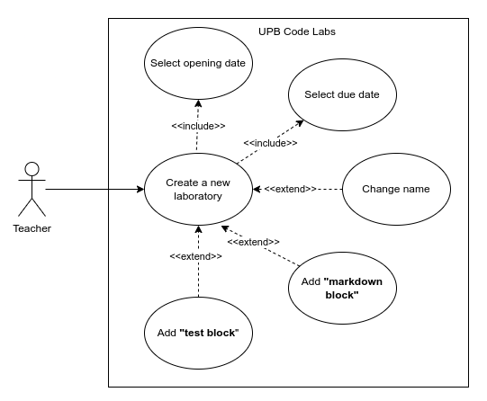
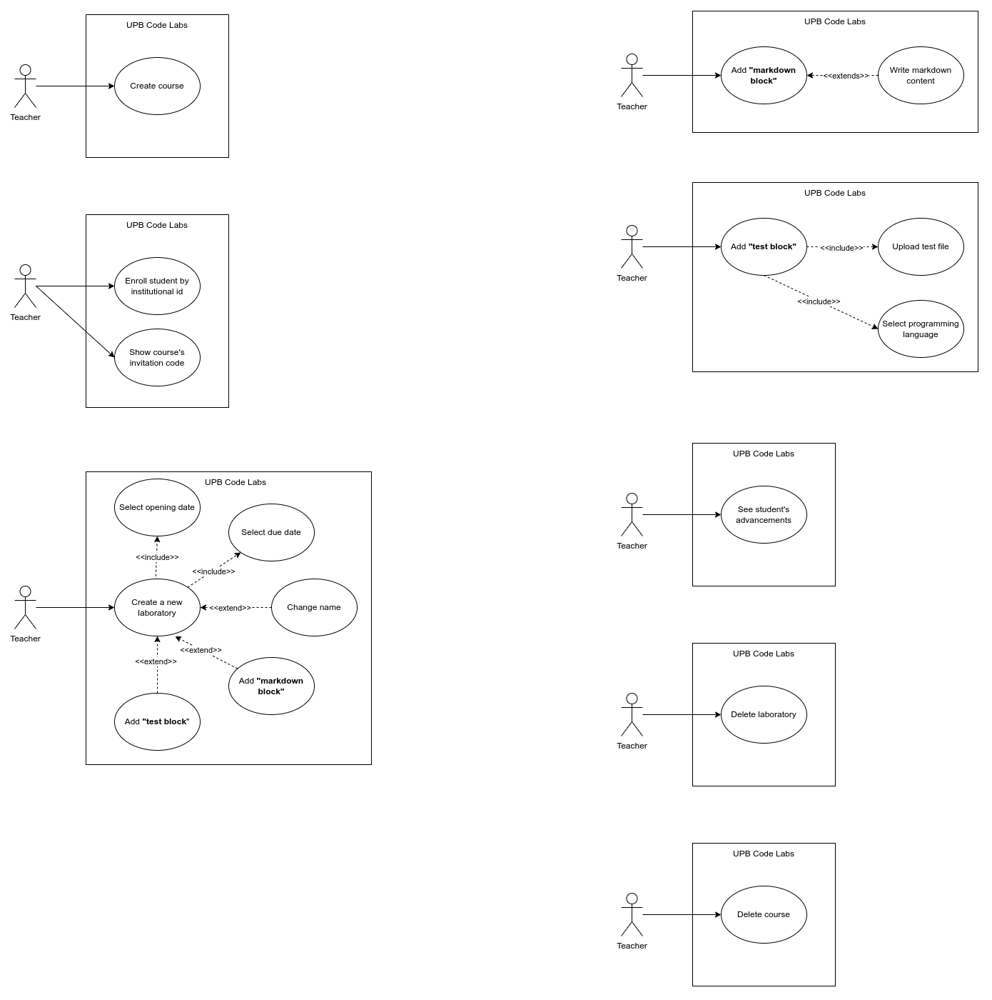
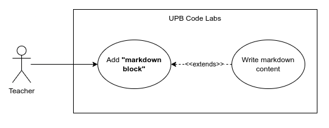
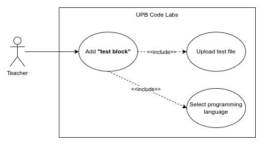

# Teacher use cases

Using the system, teachers can:

## Account management

### Login

## Courses management

### Create a new course

### Delete a course

### Enroll an student

## Laboratories management

### Create a new laboratory

### Delete a laboratory

### Add "Markdown block"

### Add "Test block"

### Check student's advancement

