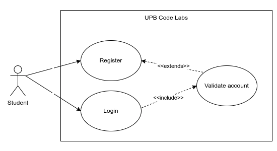
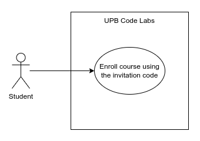
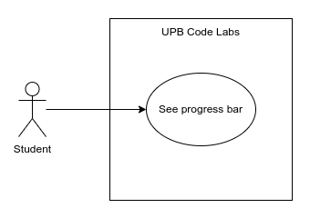

# Student use cases

Using the system, students can:

## Account management

### Register and login

## Course management

### Enroll in a course

## Laboratories management

### Complete a laboratory

### Submit code

### See progress

