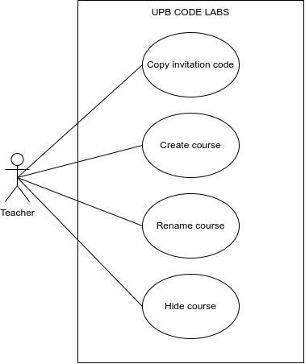
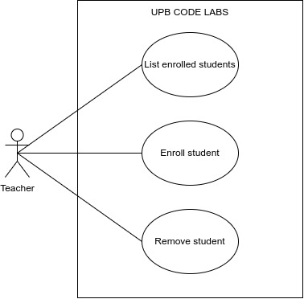
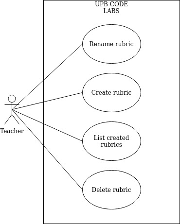
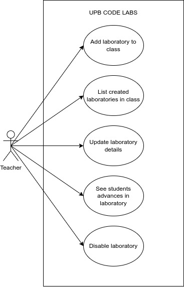
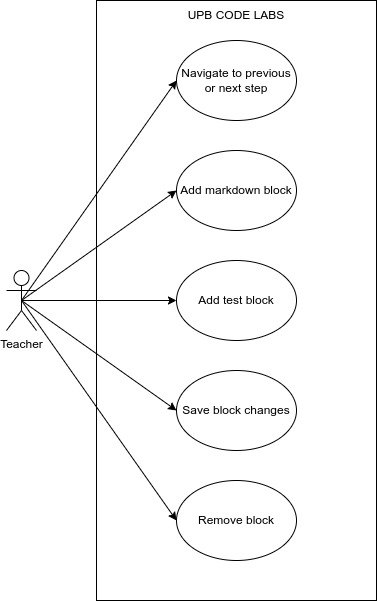
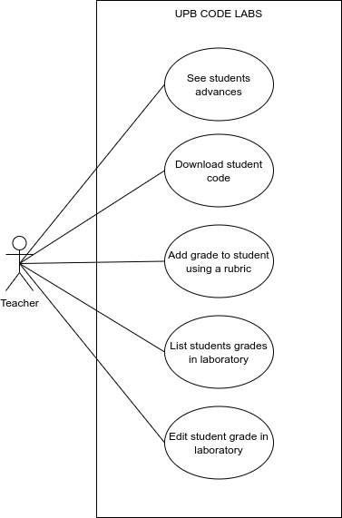

# Teacher use cases 🧑‍🏫

## Courses 📚

### Courses management

### Students enrollment

## Rubrics 🗒️

### Rubrics management

## Laboratories 🧪

### Laboratories management

### Blocks management

Laboratories are conformed by **steps**. Each step is conformed by **tasks** or **blocks**. Blocks are the smallest unit of a laboratory. Then can be Markdown or Testing blocks.

### Grades management

