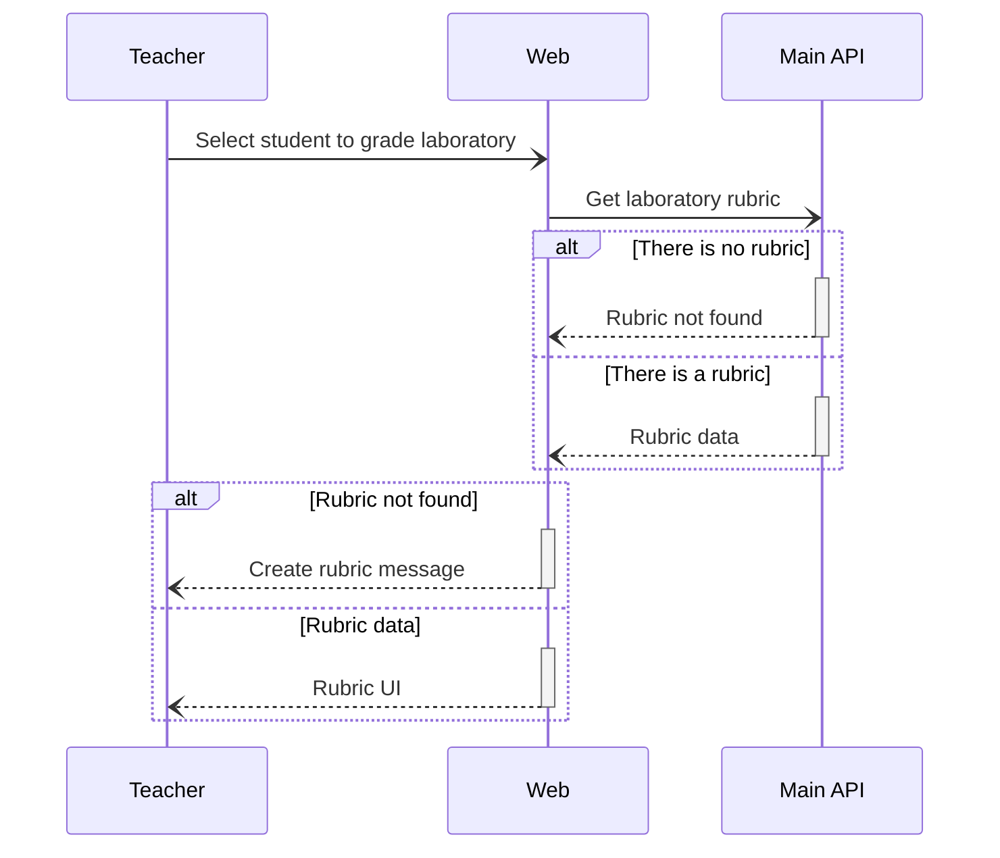
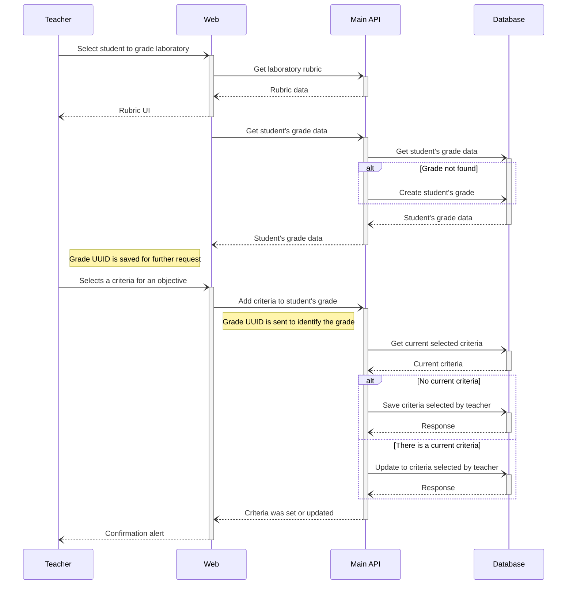

# Grade student laboratory

## 1. Get the rubric

It's necessary to have a rubric associated with the laboratory in order to grade it:

## 2. Grade the laboratory

Supposing that the rubric exists, the teacher can grade the laboratory by selecting a criteria for each objective:

