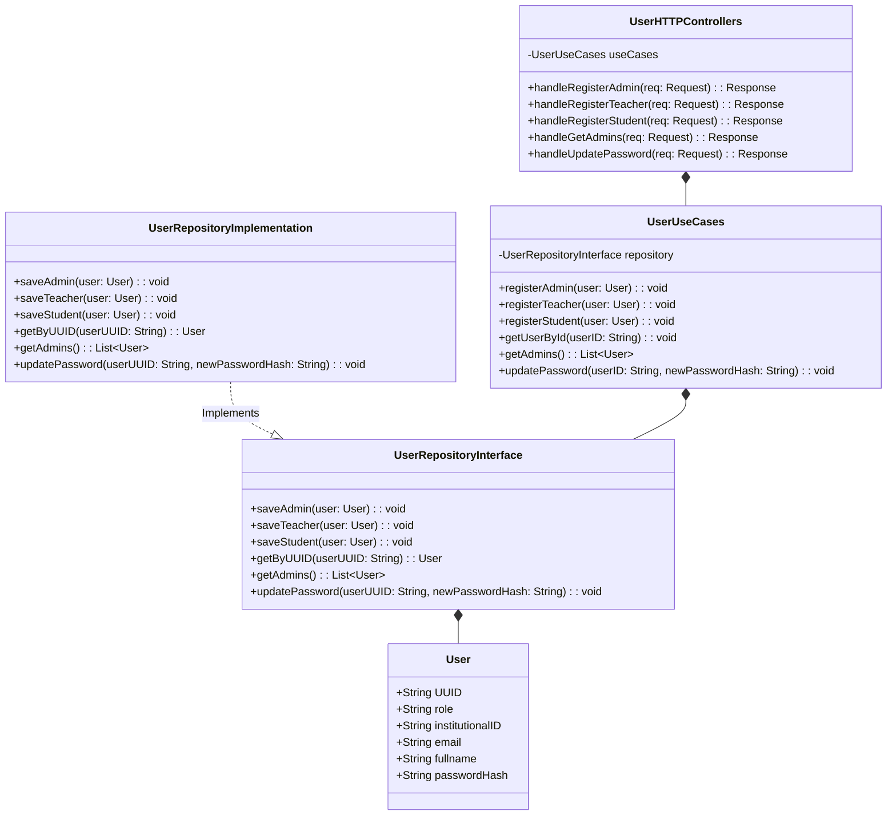

# Main API Software Architecture 🏗️

An implementation of the `Hexagonal Architecture` will be used to build the main API. In this case, each package (Eg. `users`, `laboratories`) will have its own `domain`, `application` and `infrastructure` layers.

## Class diagram 📊

